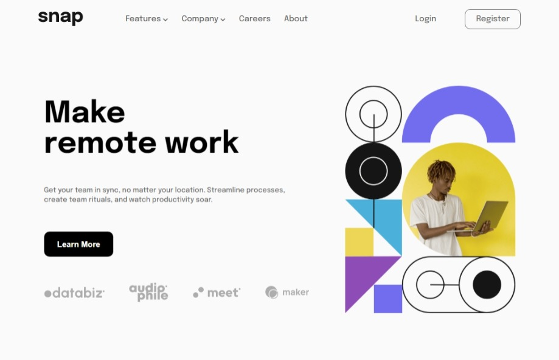
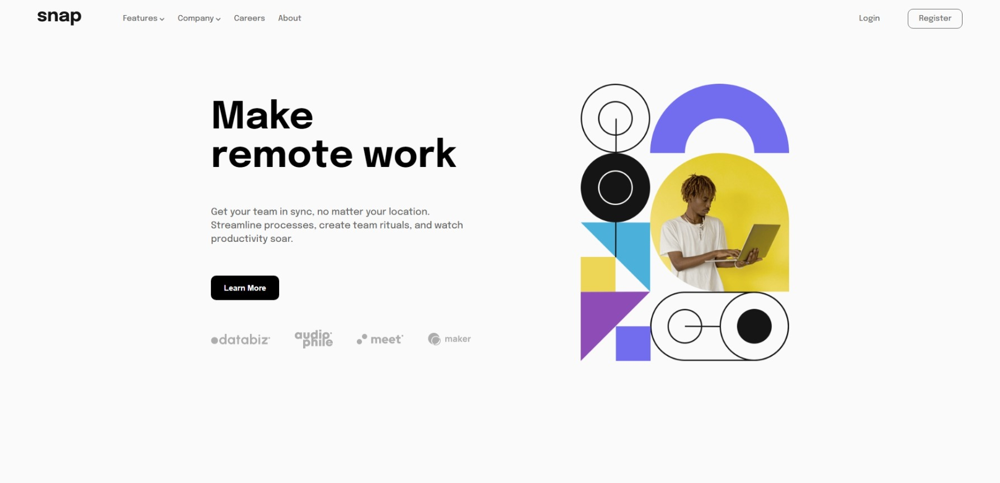
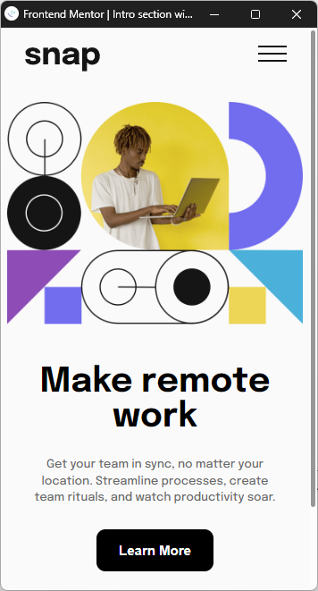
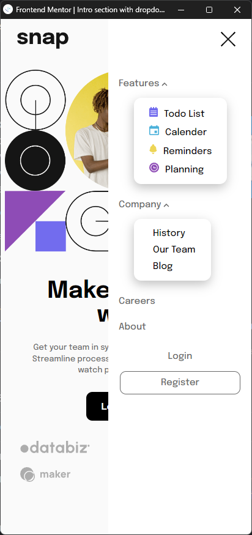

# Frontend Mentor - Intro section with dropdown navigation solution

This is a solution to the [Intro section with dropdown navigation challenge on Frontend Mentor](https://www.frontendmentor.io/challenges/intro-section-with-dropdown-navigation-ryaPetHE5). Frontend Mentor challenges help you improve your coding skills by building realistic projects.

## Table of contents

- [Overview](#overview)
  - [The challenge](#the-challenge)
  - [Screenshot](#screenshot)
  - [Links](#links)
- [My process](#my-process)
  - [Built with](#built-with)
  - [What I learned](#what-i-learned)
- [Author](#author)

## Overview

### The challenge

Users should be able to:

- View the relevant dropdown menus on desktop and mobile when interacting with the navigation links
- View the optimal layout for the content depending on their device's screen size
- See hover states for all interactive elements on the page

### Screenshot

- 1. Desktop + Mobile Preview;

    

- 2. Desktop Different Sizes;

    
    Small Width

    
    Large Width

- 3. Mobile Preview;

    

    

    With Nav Open;

### Links

- Solution URL: [Get Code Here](https://github.com/ravindra135/FrontEndMentor-intro-section-with-dropdown-navigation-main)
- Live Site URL: [Check Live Here](https://ravindra135.github.io/FrontEndMentor-intro-section-with-dropdown-navigation-main/)

## My process

### Built with

- HTML5
- CSS
- FLEXBOX
- JS

### What I learned

1. Responsive Design;
2. Responsive Navigation Bar;

## Author

- GitHub - [Github @ravindra135](https://github.com/ravindra135/)
- Frontend Mentor - [@ravindra135](https://www.frontendmentor.io/profile/ravindra135)
- Instagram - [@ravindra_since2k](https://www.instagram.com/ravindra_since2k/)
